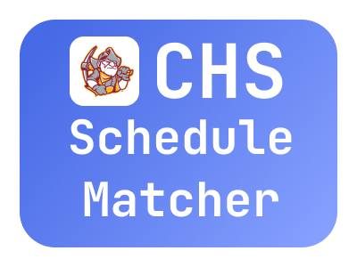

# CHS Schedule Matcher

## What is this?
This is a schedule matcher that can tell you who is in your classes without the hassle of asking everyone individually.


## How did we come up with this?
During pioneer day, it was a pain to find out which of your friends were in your classes. So, we thought of a way
to make that process way easier. Thus the CHS Schedule Matcher was created.

## How do you use it?
To use it, write your name and year in the given search fields. Enter in the teachers that you have for all periods listed and then click enter.  


## Contributing
### Setting up Dev Environment

#### Please don't stage any local project related files (ex. .idea/ .vscode/) **The gitignore file will be updated soon.**

Use any code editor that you want. If you are not part of the verified contributers, submit a pull request to get your code
inside the repo.


### Code Style

* camelCase for all function names, variables, and file names.
``` javascript
function myFunctionName() {}

let myVariable = 0;

myFileName.c
```

* Until further notice, curly brackets stay on the same line.

```javascript
function myFunction() {
    // Code
}
```

**Do not do this:**
```javascript
function myFunction()
{
    // Code
}
```
* Please keep lines to a max of 80 characters.

## Privacy Statement
ur name and year and schedule is kept in our servers ~~so that we can hack you~~ for around like 2 weeks maybe. then is gone
